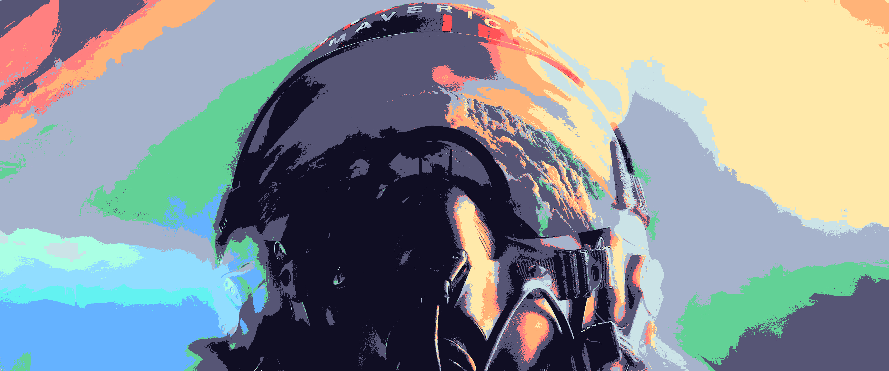
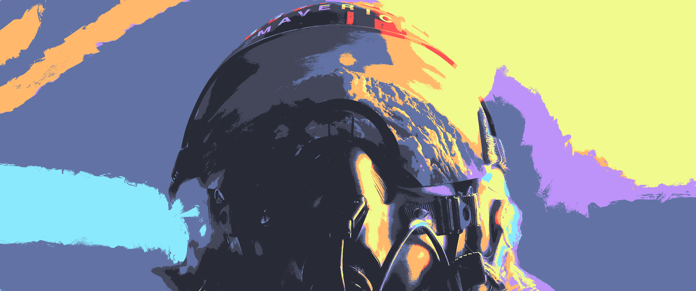
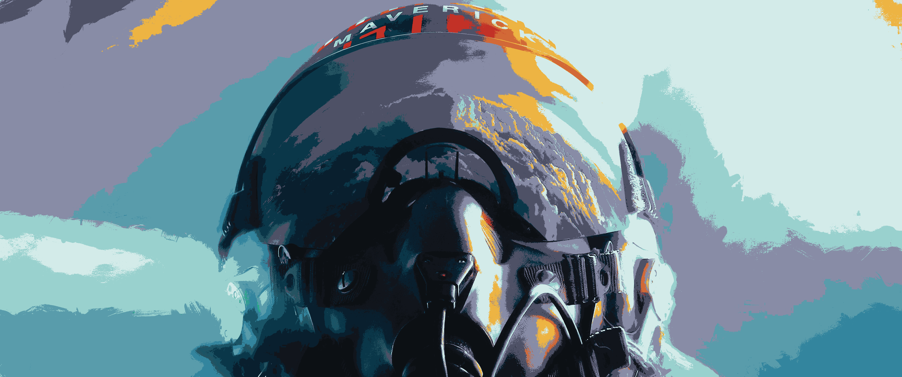
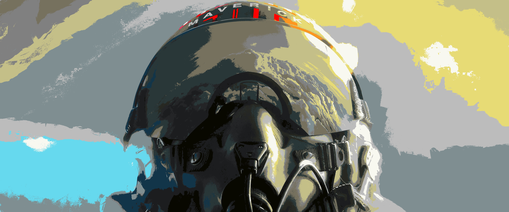
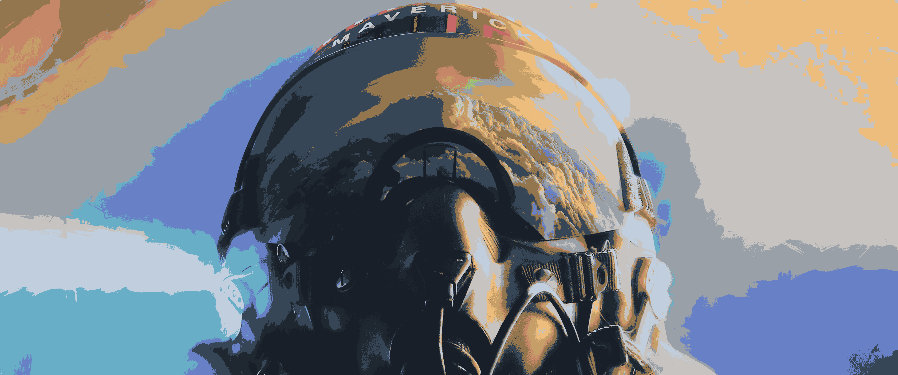
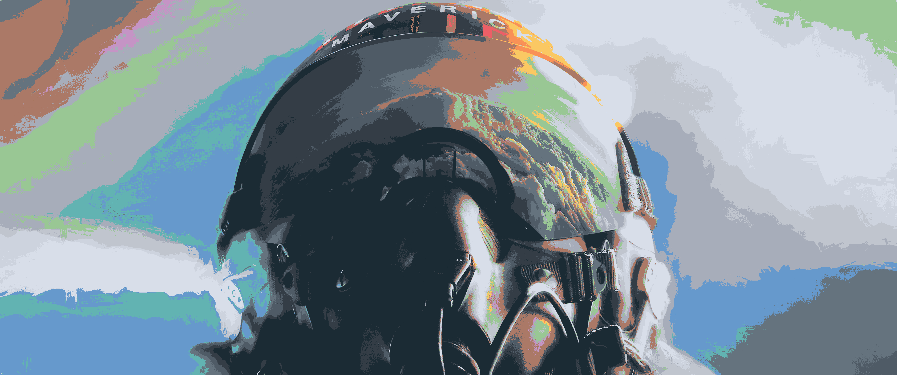
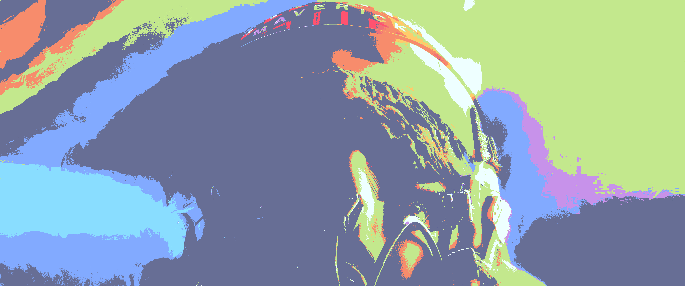
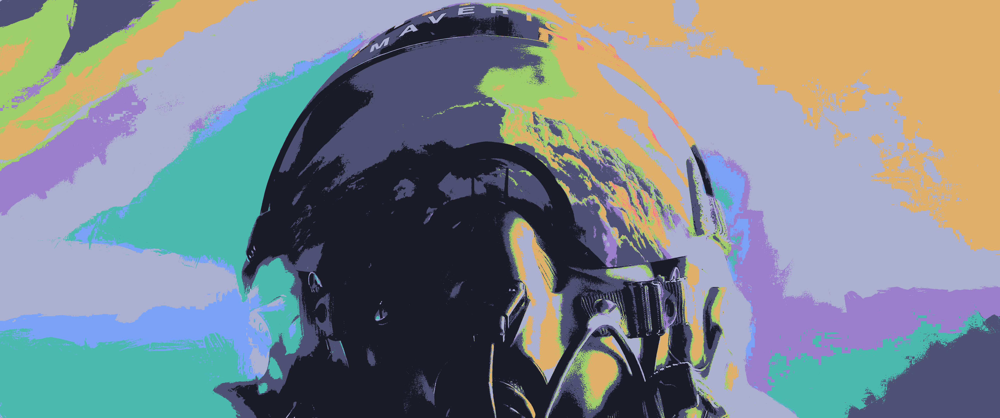
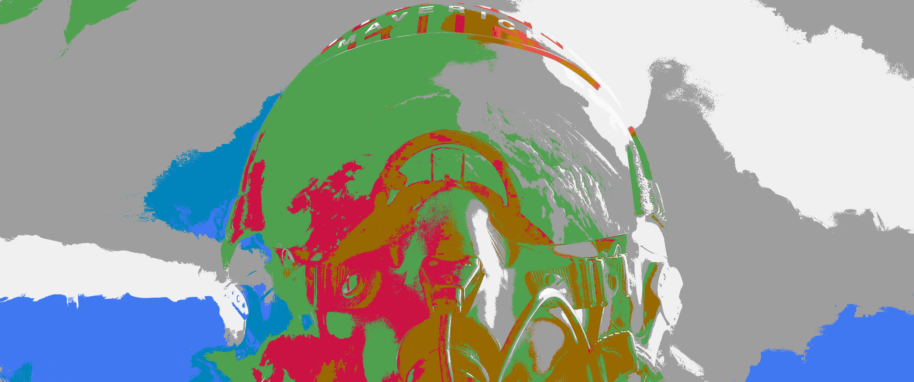
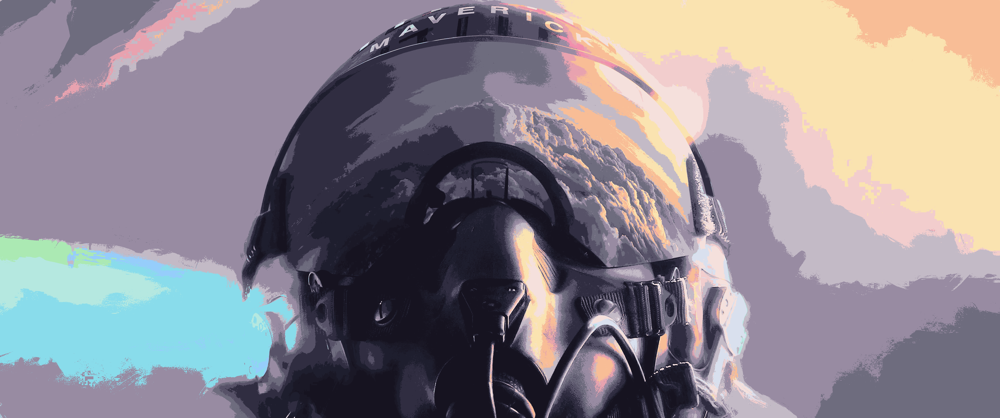

# ImageGoNord

### What is ImageGoNord

A tool that can convert your `RGB` images to `others` palette.

### What is CLI

A `command line interface`, or CLI, is a means of interacting with a computer program through text-based commands. Instead of using a `graphical user interface` (GUI), which visualizes interactions with the program, a CLI requires users to type commands to achieve the desired outcome.

There are many advantages to using a CLI. Firstly, it allows for more precise control over the program and its functions. Secondly, it is often faster to use a CLI, as it requires fewer steps to execute commands than a GUI. Additionally, CLI commands can be automated and batched, which can save time and increase efficiency.

### What is my CLI

My CLI is easier to use and more intuitive, since the user won't need to type the CLI directory like it's done in the original and it also comes with some new features like transformation by folder.

### Minimum requirements

- Node
- NPM
- Python
- Pip

```bash
# Clone repository
git clone https://github.com/KaikSelhorst/ImageGoNord-Easy.git

# Install dependencies
cd ImageGoNord-Easy
# Nord Dependencies
npm install
# Python Dependencies
pip install -r ./ImageGoNord/requirements.txt

# Global Command
npm install -g

# Run terminal CLI
GONORD
```

### Performance

This CLI doesn't have the best performance on 4k images, so you need a better computer to make the transformations faster, even if you don't have the transformations they still happen but slower

### Preview

|                               Original                               |                              Challenger                               |                                Dracula                                |
| :------------------------------------------------------------------: | :-------------------------------------------------------------------: | :-------------------------------------------------------------------: |
| <a href="01"></a>  | <a href="01"></a> |  <a href="01"></a>   |
|                                Gotham                                |                                GruvBox                                |                                Molokai                                |
|  <a href="01"></a>   |  <a href="01"></a>   |  <a href="01"></a>   |
|                              Moonlight                               |                                 nord                                  |                                Oceanic                                |
| <a href="01"></a> |    <a href="01"></a>    |  <a href="01"></a>   |
|                               Onedark                                |                               Palenight                               |                               Serenade                                |
|  <a href="01"></a>  | <a href="01"></a>  |  <a href="01"></a>  |
|                               Sonokai                                |                                 Tokyo                                 |                               Vaporwave                               |
|  <a href="01"></a>  |   <a href="01"></a>    | <a href="01"></a>  |
|                              Vaporwave                               |                                  Vim                                  |                              Catppuccin                               |
| <a href="01"></a> |    <a href="01"></a>     | <a href="01"></a> |

### Contact IGN

Github: [ImageGoNord](https://github.com/Schrodinger-Hat/ImageGoNord)

LinkedIn: [@schrodinger-hat](https://www.linkedin.com/company/schrodinger-hat/)

WebSite: [ign.schrodinger-hat.it/](ign.schrodinger-hat.it/)

### Contact Me

Github: [@KaikSelhorst](https://github.com/Schrodinger-Hat/ImageGoNord)

LinkedIn: [@KaikSelhorst](https://www.linkedin.com/in/kaikselhorst/)

Discord: [Bseven#4712](https://discord.com/users/690249250067841031)
